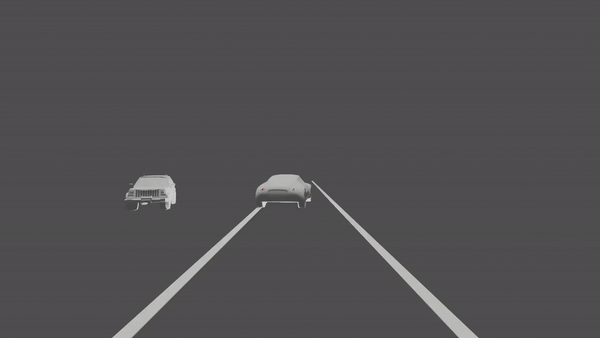

To get the output from deep learning models:

1. For 2D Object Detection, run all the cells in Human_Pose_and_MiDAS.ipynb

2. For 3D Vehicle Pose, run all the cell in Vehicle_Pose_3D

3. For Human Pose Estimation, run all cells in YOLO2D_and_MIDAS

The render sequence from blender:

